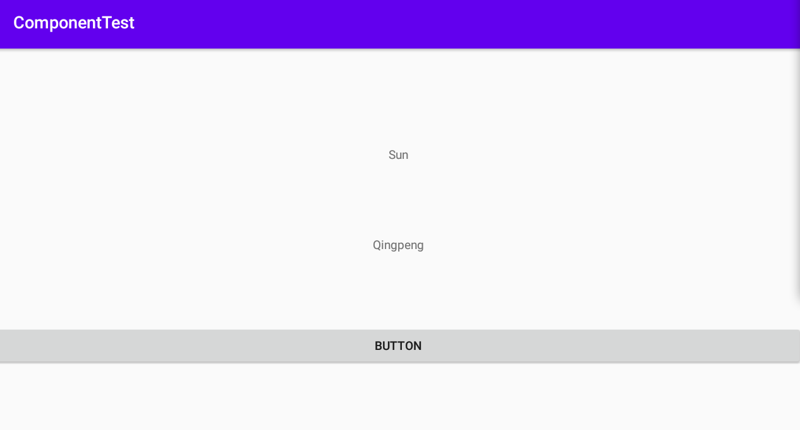

之前讲了view binding，这回说一下data binding.

测试环境 android-studio 3.6.1  

找到app下的build.gradle文件，添加data-binding支持  
```
android {
    compileSdkVersion 29
    buildToolsVersion "29.0.3"

    defaultConfig {
        applicationId "com.example.componenttest"
        minSdkVersion 16
        targetSdkVersion 29
        versionCode 1
        versionName "1.0"

        dataBinding {
            enabled = true
        }

        testInstrumentationRunner "androidx.test.runner.AndroidJUnitRunner"
    }

    buildTypes {
        release {
            minifyEnabled false
            proguardFiles getDefaultProguardFile('proguard-android-optimize.txt'), 'proguard-rules.pro'
        }
    }

}
```
建立data类:
```
public class User {
    public final String firstName;
    public final String lastName;
    public User(String firstName, String lastName) {
        this.firstName = firstName;
        this.lastName = lastName;
    }
}
```
xml必须用layout开头的，建立两个TextVIew用来显示firstName和lastName:
```
<?xml version="1.0" encoding="utf-8"?>
<layout xmlns:android="http://schemas.android.com/apk/res/android">
    <data>
        <variable name="user" type="com.example.componenttest.User"/>
        <variable
            name="main"
            type="com.example.componenttest.MainActivity" />
        <variable
            name="handler"
            type="com.example.componenttest.MyHandler" />
    </data>
    <androidx.constraintlayout.widget.ConstraintLayout
        xmlns:app="http://schemas.android.com/apk/res-auto"
        xmlns:tools="http://schemas.android.com/tools"
        android:layout_width="match_parent"
        android:layout_height="match_parent"
        >

        <TextView
            android:id="@+id/text"
            android:layout_width="wrap_content"
            android:layout_height="19dp"
            android:text="@{user.firstName}"
            app:layout_constraintBottom_toBottomOf="parent"
            app:layout_constraintLeft_toLeftOf="parent"
            app:layout_constraintRight_toRightOf="parent"
            app:layout_constraintTop_toTopOf="parent" />

        <TextView
            android:id="@+id/bindText"
            android:layout_width="wrap_content"
            android:layout_height="19dp"
            android:text="@{user.lastName}"
            app:layout_constraintBottom_toBottomOf="parent"
            app:layout_constraintLeft_toLeftOf="parent"
            app:layout_constraintRight_toRightOf="parent"
            app:layout_constraintTop_toTopOf="parent"
            app:layout_constraintVertical_bias="0.26" />

        <Button
            android:id="@+id/button"
            android:layout_width="0dp"
            android:layout_height="wrap_content"
            android:text="@string/button"
            app:layout_constraintBottom_toBottomOf="parent"
            app:layout_constraintLeft_toLeftOf="parent"
            app:layout_constraintRight_toRightOf="parent"
            app:layout_constraintTop_toBottomOf="@+id/text"
            android:onClick="changeData"
            />

    </androidx.constraintlayout.widget.ConstraintLayout>
</layout>
```
主程序：
```
import androidx.appcompat.app.AppCompatActivity;
import androidx.databinding.DataBindingUtil;

import android.os.Bundle;

import com.example.componenttest.databinding.ActivityMainBinding;

public class MainActivity extends AppCompatActivity {

    @Override
    protected void onCreate(Bundle savedInstanceState) {
        super.onCreate(savedInstanceState);
        ActivityMainBinding binding = DataBindingUtil.setContentView(this, R.layout.activity_main);
        User user = new User("Qingpeng", "Sun");
        binding.setUser(user);
    }
}
```
效果：


使用可观察数据对象
改变User类
```
import androidx.databinding.ObservableField;
public class User {
    public ObservableField<String> firstName = new ObservableField<>();
    public ObservableField<String> lastName = new ObservableField<>();
    public User(String firstName, String lastName) {
        this.firstName.set(firstName);
        this.lastName.set(lastName);
    }
}

```
增加Button点击函数
```
public class MainActivity extends AppCompatActivity {

    private User user = new User("Qingpeng", "Sun");

    @Override
    protected void onCreate(Bundle savedInstanceState) {
        super.onCreate(savedInstanceState);
        ActivityMainBinding binding = DataBindingUtil.setContentView(this, R.layout.activity_main);
        binding.setUser(user);
    }

    public void changeData(View view) {
        user.firstName.set("Laoshi");
    }
}
```


