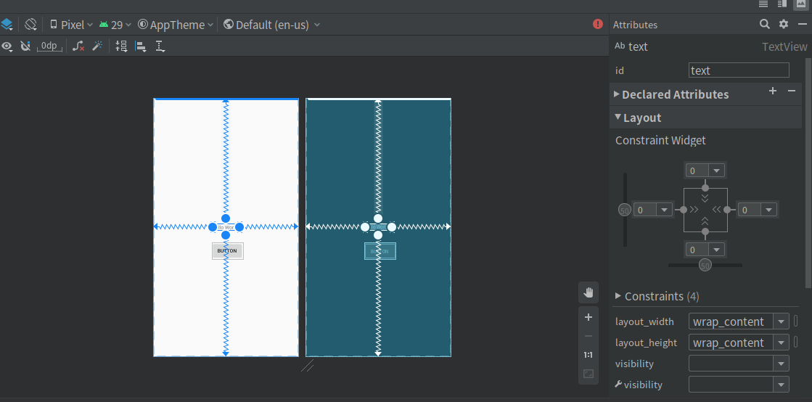
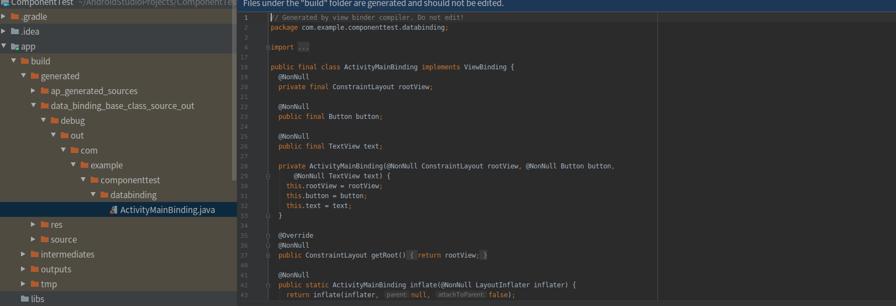

测试环境 android-studio 3.6.1  

找到app下的build.gradle文件，添加view-binding支持  
```
android {
    compileSdkVersion 29
    buildToolsVersion "29.0.3"

    defaultConfig {
        applicationId "com.example.componenttest"
        minSdkVersion 16
        targetSdkVersion 29
        versionCode 1
        versionName "1.0"

        viewBinding {
            enabled = true
        }

        testInstrumentationRunner "androidx.test.runner.AndroidJUnitRunner"
    }

    buildTypes {
        release {
            minifyEnabled false
            proguardFiles getDefaultProguardFile('proguard-android-optimize.txt'), 'proguard-rules.pro'
        }
    }

}
```
我们在新建的工程里的Layout xml中，加入一个Button，再给Text加一个id，如果没有ID，绑定类将不会存在他的引用。

编译一下，我们就可以看到，IDE为我们生成的类。以下是生成的规则：
为某个模块启用视图绑定功能后，系统会为该模块中包含的每个 XML 布局文件各生成一个绑定类。每个绑定类均包含对根视图以及具有 ID 的所有视图的引用。系统会通过以下方式生成绑定类的名称：将 XML 文件的名称转换为驼峰式大小写，并在末尾添加“Binding”一词。

接下来，我们就可以使用了。代码如下：
```
public class MainActivity extends AppCompatActivity {
    private ActivityMainBinding mainBinding;

    @Override
    protected void onCreate(Bundle savedInstanceState) {
        super.onCreate(savedInstanceState);
        mainBinding = ActivityMainBinding.inflate(LayoutInflater.from(this));
        setContentView(mainBinding.getRoot());
        mainBinding.button.setOnClickListener(new View.OnClickListener() {
            @Override
            public void onClick(View v) {
                mainBinding.text.setText("hello view binding");
            }
        });
    }
}
```
THE END
