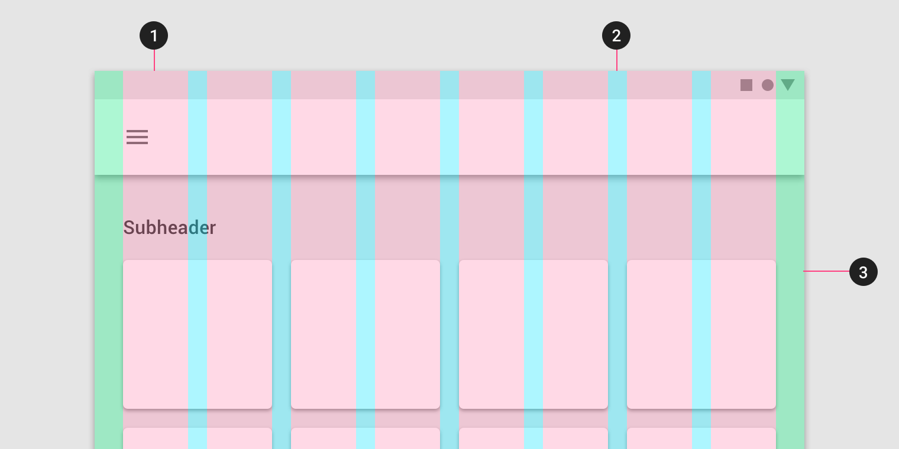

资料基本上来自于Google的Material Design网站，<https://material.io/>
谷歌对设计原则，组件，Icons，辅助设计，开发都做了相关的建议。

* 设计
  * Layout: 可预测，可感知，前后设计一致。响应式。  <https://material.io/design/layout/responsive-layout-grid.html#>  
     大部分组件8dp对齐，Icon 4dp对齐。  
     三个概念Column，Gutter，Margin
     
     列(Column)：根据百分比定义，而不是固定值。  
     
     
     沟(Gutter)：两个列之间的空间，根据不同的宽度确定不同的固定值。360dp为16dp， 600dp为24dp。
     
     
     边距(Margin)：内容与左右边距的空间。和Gutter一样，根据不同的宽度确定不同的固定值。
     

  * Navigation: 分为侧向导航，前向导航，返回导航。
     横向导航(Lateral navigation)：侧边栏，底部导航，Tab导航。
     
     
     
     前向导航(Forward navigation)：向下引入内容，一系列的流，引入到其它APP。  
     实现方式：卡片，列表等容器，按钮中转，搜索，内容链接。  
     返回导航(Reverse navigation)：返回键。
     
  
  * Color: 主颜色，次要颜色，亮暗主题。
    
    工具：<https://www.materialpalette.com/>
    

