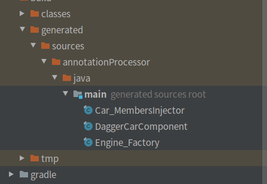

依赖注入是设计模式基础原则之一，原则是上层模块不依赖于下层模块，而是依赖于一套抽象接口，上层模块调用接口，下层模块实现接口。  
举一个google官网上的例子。 
汽车都有一个发动机，我们有3种方法去得到发动机这个对象：
1. 汽车自己实例化发动机。
```Java
class Car {

    private Engine engine = new Engine();

    public void start() {
        engine.start();
    }
}
class MyApp {
    public static void main(String[] args) {
        Car car = new Car();
        car.start();
    }
}
```
2. 用其它方法获得，比如从修理厂的getEngine方法获得一个。
3. 发动机作为一个参数，把这个参数传到汽车的类里。
```Java
class Car {

    private final Engine engine;

    public Car(Engine engine) {
        this.engine = engine;
    }

    public void start() {
        engine.start();
    }
}
class MyApp {
    public static void main(String[] args) {
        Engine engine = new Engine();
        Car car = new Car(engine);
        car.start();
    }
}
```
第3种的实现就是依赖注入，依赖注入的好处：
1. Car的重用，如果有另外的发动机，可以直接利用Car中的方法。
2. 更容易对Car类的测试。  
上面的注入方式，是手动注入的方式。下面我们来介绍一下通过Dagger来实现DI。  
```Java
class Car {
    ＠Inject
    Engine engine;
    public Car() {
        DaggerCarComponent.builder().build().inject(this);
    }
    public void start() {
        engine.start();
    }
}
public class Engine {
    @Inject
    public Engine() {}

    public void start() {
        System.out.println("Engine, start!");
    }
}
@Component
public interface CarComponent {
    void inject(Car car);
}
class MyApp {
    public static void main(String[] args) {
        Car car = new Car();
        car.start();
    }
}
```
可以和上面的代码比较一下，只是通过注释来完成setEngine的过程，Dagger还会生成3个辅助类，如下图：  
  
 如果Engine类不可以修改，无法在构造函数在注释。我们就需要Module的概念。@Provides提供需要的对象。
 ```Java
@Module
public class EngineModule {
    @Provides
    static Engine provideEngine() {
        return new Engine();
    }
}
 ```
 其它的代码不变，Engine类的@Inject注释就不用了。
 