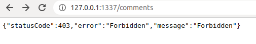
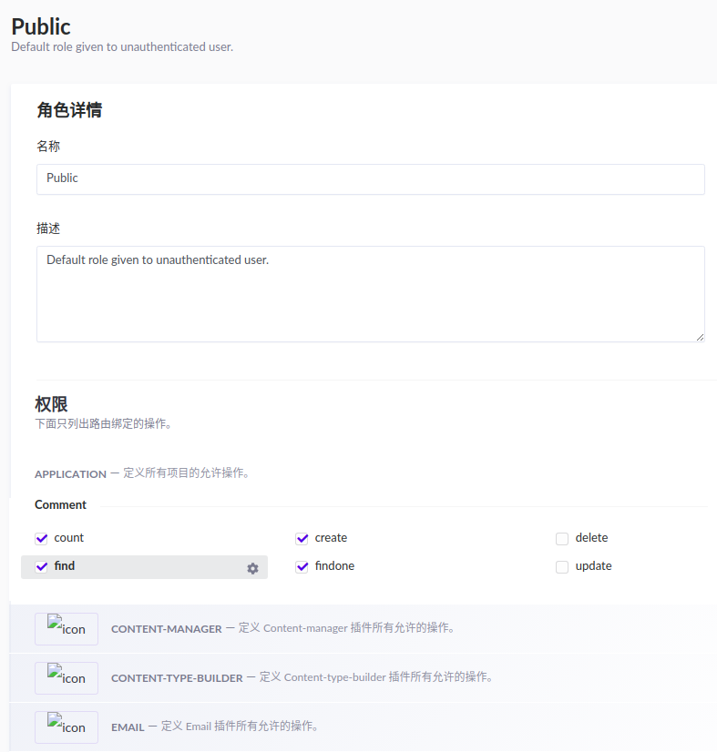
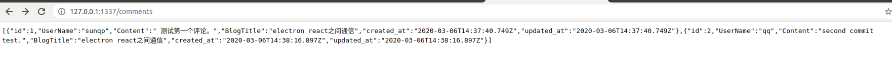

之前讲了strapi环境的简单搭建，并且建立了评论的ContentType。
这回讲一下，strapi如何向外提供api。

api文档路径：<https://strapi.io/documentation/3.0.0-beta.x/content-api/api-endpoints.html#endpoints>  
可以看到取得数据接口：GET	/{content-type}

我们访问一下，发现返回没有权限，返回403。

原来是没有设定权限，在左边菜单上选角色＆权限，然后找到Public选项，最后选择相应权限。  
我们这边选了`find`，`create`，`findone`

保存后，再次查看，可以访问了。

