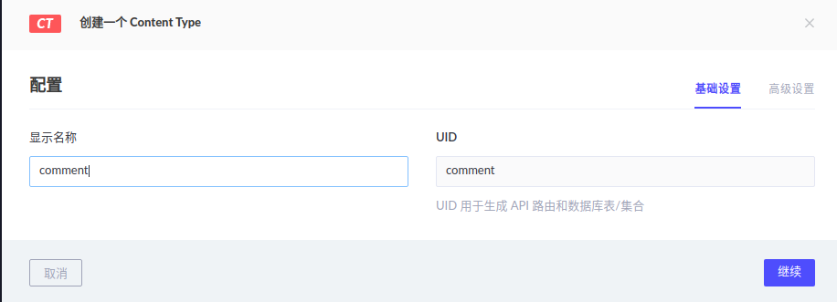
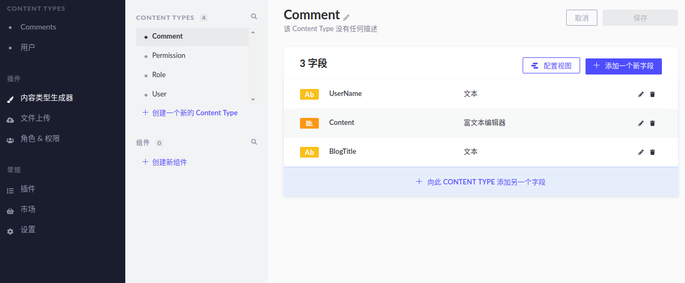
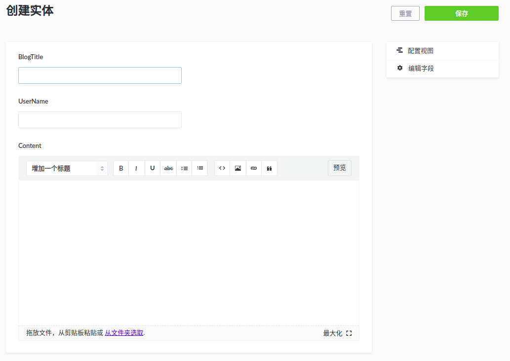

Blog搭建完成，可惜缺少评论部分。官网建议的Disqus等工具，不是被墙，就是收费贵。  
之前了解了strapi，并且做过一些测试，最后确定react+antd+strapi去实现评论系统。
这里我们先介绍一下strapi。

strapi是一个headless CMS，简单说一个只提供数据的内容管理系统，不关注UI，内容优先。   
可以去<https://headlesscms.org/>这个网站看一个流行的headless cms，strapi排名靠前。

快速建立一个strapi工程：  
`yarn create strapi-app my-project --quickstart`

建立之后，他会自动启动默认浏览器，并且打开管理员的首页。<http://localhost:1337/admin/>
输入账号密码后，进入管理页面。

看到了strapi对中文支持还是不错的。

选择新建一个ContentType，也就是内容类型。可以理解成为传统网站一个数据库表。

之后加入新的字段UserName，类型是文本，也就是评论人的名字。

同样建立评论内容和评论Blog的Title。建立完成如下图：

完成后，我们可以在左边的菜单栏看到Content Type里多了Comments，点击进入编辑

输入相关信息，保存后，一条评论就完成了。

简单的几步，就把一个内容管理系统搭建完成。可以用它轻松管理各种内容。

